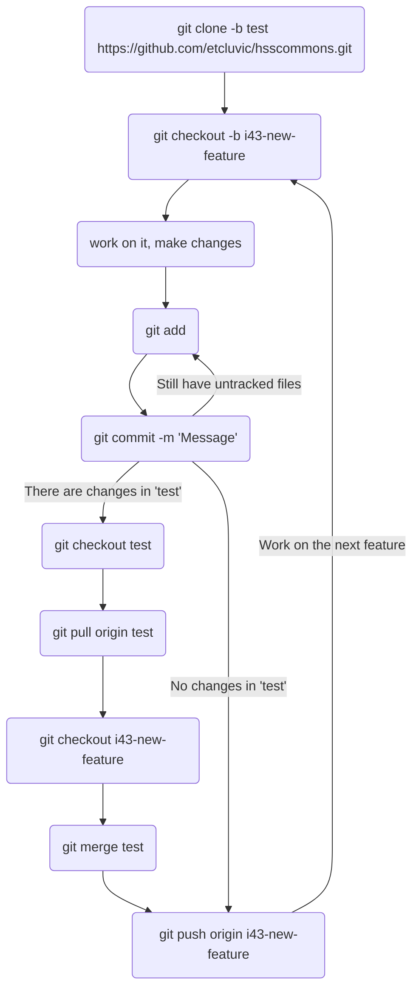

# HSSCommons Overlay

This repository contains code modified for the HSSCommons project by CANARIE. It acts as an overlay to the [HUBzero CMS](https://github.com/hubzero/hubzero-cms) code to customize HUBzero for use by HSSCommons.****

The HSSCommons git repository consists of two main branches: `test` and `h2.2.22`.

The `test` branch is associated with the [test instance of the HSSCommons site](https://test.hsscommons.ca).

# Installation

This code should be placed in the /app folder of the HUBzero CMS. It is currently developed against version 2.2.22 of HUBzero.

# Contributing to HSSCommons

<!-- 1. Open a terminal session and clone the `test` branch using `git clone -b test https://github.com/etcluvic/hsscommons.git`
2. Run a `git pull` to update your local repository with any changes that any other collaborators have made.
3. Make any changes to the `test` branch as follows. 
4. Edit the files as required. Use `git add <file name>` to stage these changes.
5. Use `git commit -m '<commit message>'` to commit your changes.
6. Use `git push --set-upstream origin test` to push your commits to the remote repo.
7. Once the feature has been fully debugged and confirmed to be working as expected, the changes from the `test` branch can be merged with the `h2.2.22` branch.
8. Open a browser window with the URL of the HSSCommons git repo. Click on pull requests and create a new one.
9. Compare the changes between the `test` branch and the `h2.2.22` branch. The changes you just pushed on the `test` branch should be highlighted. Verify the changes and create the pull request. Make sure to write a descriptive comment.
10. Verify that there are no conflicts, proceed an merge the request. Do not delete the `test` branch when asked if you want to delete it. -->

Start by running the following:
```
$ git clone -b test https://github.com/etcluvic/hsscommons.git      # Clone 'test' branch                                                       
$ git checkout -b i43-new-feature                                   # Create a new branch, named after an issue number and description
```
You can start making changes to the code. After finishing making changes:
```
$ git add <file name>                                               # State changes for each file
$ git commit -m '<commit message>'                                  # commit your changes
```
There are two cases that can happen here.

**Case 1**: If there are changes in the `test` branch from when you pulled the branch, run:
```
git checkout test                                                   # Switch back to 'test' branch
git pull origin test                                                # Pull the latest changes on 'test'
git checkout i43-new-feature                                        # Switch back to your feature branch
git merge test                                                      # Merge the new changes in 'test' branch into your feature branch
git push origin i43-new-feature                                     # Push your changes to the feature branch on the remote server
```

**Case 2**: If `test` branch stays the same from when you pulled the branch, just run:
```
git push origin i43-new-feature                                     # Push your changes to the feature branch on the remote server
```

If you think your branch is ready to merge, create a Pull Request as follow:

1. Visit [HSSCommons GitHub repository](https://github.com/etcluvic/hsscommons)
2. Click **Pull Requests**, select **New pul request**
3. For **compare**, select your branch (`i43-new-feature` in this case). For **base**, select `test`
4. Compare the changes between the your branch and the `test` branch. The changes you just pushed on your branch should be highlighted. Verify the changes and make sure to write a descriptive comment.
5. Click **Create Pull Request**
6. One of the team members will review the branch, and merge it into `test` for you.
7. If the feature works well on the [Test Instance](https://test.hsscommons.ca), the team member will merge it into `h2.2.22` branch
8. To have the [h2.2.22 instance](https://hsscommons.ca) reflect the changes in the `h2.2.22` branch, we need to create a ticket with UVic Systems.

To continue working on the next feature, simply repeat the process above, start with running:
```
$ git checkout -b i44-next-new-feature                              # Create a new branch for the next new feature
```

The work process can be described in the chart below:


# Adding files from hubzero-cms

As mentioned above the code in this repository acts as an overlay to the [Hubzero CMS](https://github.com/hubzero/hubzero-cms) code. To make new customizations to files that exist in the hubzero-cms core but not in this repository follow the following steps.

1. Clone the hubzero-cms repo somewhere on your system using `git clone -b 2.2.22 https://github.com/hubzero/hubzero-cms.git` (only needs to be done once)
2. Copy the directory you want to modify from the hubzero-cms to the hsscommons local repo on your system. Ensure to maintain the directory structure as much as possible. For example if the folder exists in `hubzero-cms/core/plugins/publications/` then the copied folder should go to `hsscommons/plugins/publications`
3. `git add, commit and push` the files that have just been copied over.
4. Make any modifications to the copied files.

# Licence

This code maintains the [MIT](http://opensource.org/licenses/MIT) licence of the original files.
